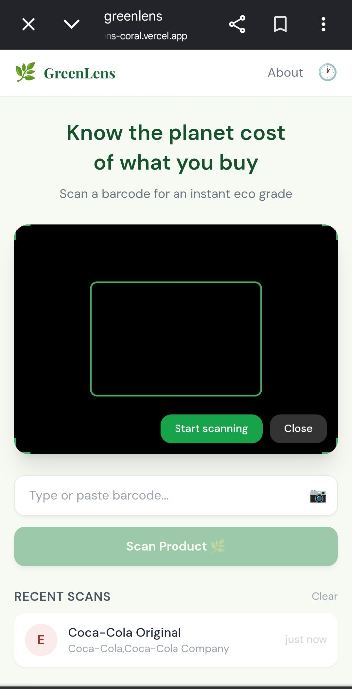
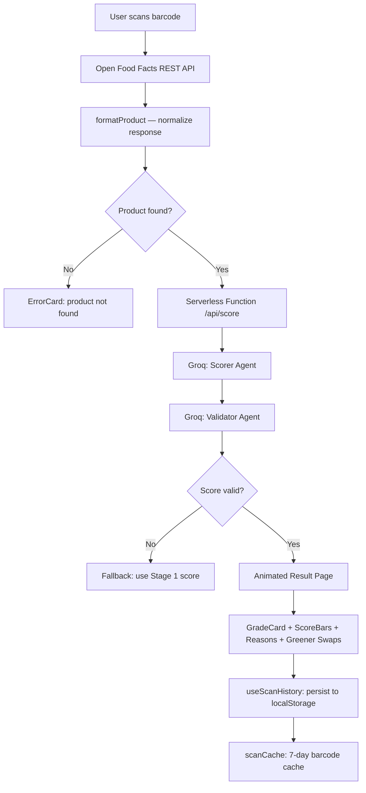

<p align="center">
  
</p>

<p align="center">
  <strong>Scan any barcode. Know its planet cost. Instantly.</strong>
</p>

<p align="center">
  
  
  
  
  
</p>

---

**GreenLens** turns any product barcode into an environmental report card in under 5 seconds.
Scan or type a barcode and get an A–F eco grade, three sustainability sub-scores (CO₂,
water, packaging), the specific reasons behind the rating, and greener product categories
to look for — all powered by a two-stage AI pipeline analyzing real data from the Open
Food Facts database.

> No signup. No install. Works on any smartphone or desktop browser.
---

**GreenLens** is a mobile-first web app that turns any product barcode into an environmental report card. Scan or type a barcode, and within seconds you get an A–F eco grade, three sustainability sub-scores, the reasons behind the rating, and greener product alternatives — all powered by AI analyzing real product data from the Open Food Facts database.

> No signup. No install. Works in any modern browser.

<p align="center">
  
</p>

---

## The Problem

Consumers worldwide make over **500 billion grocery purchasing decisions every year** with
virtually zero environmental context. People want to make sustainable choices, but existing
tools are fragmented, slow, or require an account — none of them work at the speed of a
checkout line.

Certification labels are scattered across dozens of schemes. Environmental databases are
behind paywalls. Scanning apps focus on nutrition, not ecology. The result: sustainability
is something people care about in the abstract, but abandon the moment they're standing
in a supermarket aisle.

## How GreenLens Solves It

| Challenge | Status quo | GreenLens |
|-----------|-----------|-----------|
| Getting eco data fast | Search multiple sites manually | Scan once, results in seconds |
| Understanding environmental impact | Dense certification jargon | A–F grade anyone can read |
| Knowing what to buy instead | No in-context suggestions | AI-generated greener swaps, instantly |
| Access to product data | Fragmented, paid databases | Open Food Facts — 3M+ products worldwide |
| Nuanced AI scoring | Keyword-based rules engines | LLM reasoning over ingredients, NOVA group, packaging, and food miles |

---

## System Architecture



**Security note:** The Groq API key is never exposed to the client. All AI calls are proxied through a Vercel serverless function ().

**Two-stage AI pipeline with self-validation:** A scorer agent generates the initial environmental assessment. A second validator agent then audits the output for logical consistency — enforcing domain rules (ultra-processed NOVA 4 products cannot score highly on CO₂; beef products must have a low water score) and aligning grades with Open Food Facts certified ecoscore data when available. If the validator detects an inconsistency, it returns a corrected score. If the validator itself fails, the system gracefully falls back to the Stage 1 result. This produces significantly more reliable scores than single-pass LLM scoring.

---

## Features

- **Barcode scanning** — Type a barcode or use your device's camera with native `BarcodeDetector` (EAN-13, EAN-8, UPC-A, UPC-E, Code 128)
- **AI eco scoring** — Groq-powered LLM analyzes product ingredients, processing level (NOVA group), packaging materials, and supply chain signals to produce a nuanced grade
- **A–F grade + three sub-scores** — Overall grade plus individual scores for CO₂ footprint, water usage, and packaging, each 0–100
- **Specific reasons** — Three data-driven sentences explaining exactly why the product received its grade
- **Greener swaps** — Up to three alternative product suggestions with their estimated grades
- **Scan history** — Last 10 scans stored locally; tap any entry to revisit its results without re-scanning
- **Animated result cards** — Grade letter springs into view; score bars fill progressively with color-coded thresholds
- **Honest limitations** — An always-visible disclaimer that scores are AI estimates, not certified assessments

---

## How It Works

```
User scans barcode
       │
       ▼
Open Food Facts API          ← 3 million products
(product name, brand,
 ingredients, NOVA group,
 packaging, ecoscore_grade)
       │
       ▼
Groq AI (LLM prompt)         ← ingredients + NOVA + packaging + food miles
       │
       ▼
Structured JSON response
{
  grade: "B",
  overall_score: 74,
  co2_score: 80,
  water_score: 65,
  packaging_score: 72,
  reasons: [...],
  greener_swaps: [...]
}
       │
       ▼
Animated result page
```

The AI prompt explicitly asks the model to consider:

- **CO₂ score** — Food miles, processing level (NOVA 1 = unprocessed, 4 = ultra-processed), animal vs. plant-based origin
- **Water score** — Water-intensive crops (almonds, beef, avocado score low), production water use
- **Packaging score** — Glass and cardboard score high; single-use plastic scores low

---

## Grade Scale

| Grade | Label | Score Range |
|-------|-------|-------------|
| A | Excellent | 85 – 100 |
| B | Good | 70 – 84 |
| C | Average | 50 – 69 |
| D | Poor | 30 – 49 |
| E | Very Poor | 15 – 29 |
| F | Harmful | 0 – 14 |

---

## Quick Start

### Option 1: Use the live demo

Open the deployed URL in any modern browser on your phone or desktop. No installation required.

### Option 2: Run locally

```bash
# 1. Clone the repo
git clone https://github.com/code-withkrishna/greenlens.git
cd greenlens

# 2. Install dependencies
npm install

# 3. Install Vercel CLI (required to run serverless functions locally)
npm i -g vercel

# 4. Add your Groq API key
cp .env.example .env
# Edit .env and set GROQ_API_KEY=your_key_here
# Get a free key at https://console.groq.com → API Keys → Create Key

# 5. Start the dev server (Vite + serverless functions together)
vercel dev
```

Open `http://localhost:3000` in your browser.

> **Note:** `npm run dev` starts the Vite dev server only and cannot run the `/api/score`
> serverless function. Use `vercel dev` for a full local environment with AI scoring enabled.

### Option 3: Build for production

```bash
npm run build
# Output is in /dist — deploy to any static host (Vercel, Netlify, Cloudflare Pages)
```

---

## Configuration

| Variable | Required | Description |
|----------|----------|-------------|
| `VITE_GROQ_API_KEY` | Yes | Your Groq API key. Free tier is sufficient for development. Get one at [console.groq.com](https://console.groq.com) |

---

## Tech Stack

| Layer | Technology |
|-------|-----------|
| UI framework | React 19 |
| Routing | React Router 7 |
| Styling | Tailwind CSS |
| Fonts | DM Sans, Playfair Display |
| Build tool | Vite |
| AI scoring | Groq API (LLM inference) |
| Product data | Open Food Facts REST API |
| Camera scanning | Native `BarcodeDetector` Web API |
| HTTP client | Axios |
| State persistence | `localStorage` (scan history) |

---

## Comparison

| Feature | GreenLens | Yuka | Open Food Facts app | Google Lens |
|---------|:---------:|:----:|:-------------------:|:-----------:|
| Environmental grade | ✅ | ❌ (health only) | Partial | ❌ |
| AI-generated reasons | ✅ | ❌ | ❌ | ❌ |
| Greener swap suggestions | ✅ | ❌ | ❌ | ❌ |
| No account required | ✅ | ❌ | ✅ | ✅ |
| Open source | ✅ | ❌ | ✅ | ❌ |
| Sub-scores (CO₂/water/packaging) | ✅ | ❌ | ✅ (ecoscore) | ❌ |
| Works in browser (no install) | ✅ | ❌ | ❌ | ❌ |

---

## Data Sources

- [Open Food Facts](https://world.openfoodfacts.org) — Open, crowd-sourced product database with 3M+ entries including ingredients, packaging tags, NOVA group, and ecoscore
- [Groq + LLM](https://groq.com) — Ultra-fast inference for structured environmental scoring

---

## Project Structure

```
greenlens/
├── index.html              # Entry point
├── .env.example            # Environment variable template
├── src/
│   ├── main.jsx            # React root
│   ├── App.jsx             # Router setup (/, /result, /about)
│   ├── pages/
│   │   ├── Home.jsx        # Barcode input + scan history
│   │   ├── Result.jsx      # Grade card + sub-scores + swaps
│   │   └── About.jsx       # Methodology + limitations
│   ├── components/
│   │   ├── BarcodeForm.jsx # Text input + camera trigger
│   │   ├── CameraScanner.jsx # BarcodeDetector integration
│   │   ├── GradeCard.jsx   # Animated A–F display
│   │   ├── ScoreBar.jsx    # Animated score bars
│   │   ├── HistoryList.jsx # Recent scans
│   │   └── ErrorCard.jsx   # Error states
│   ├── hooks/
│   │   ├── useCamera.js    # BarcodeDetector + getUserMedia
│   │   └── useHistory.js   # localStorage scan history
│   └── api/
│       ├── openFoodFacts.js # Product lookup
│       └── score.js        # Groq AI scoring prompt
└── dist/                   # Production build
```

---

## Limitations

GreenLens scores are AI estimates based on available product data — not certified environmental assessments. Data quality varies by product (some entries on Open Food Facts are incomplete). Use the scores as a directional guide, not a definitive rating.

---

## Roadmap

- PWA support with offline caching
- Share result as a card (Web Share API)
- Aggregate household footprint tracker
- Certified ecoscore crosscheck when available
- Multi-language support

---

## Contributing

Contributions are welcome. Please open an issue first to discuss what you'd like to change. Pull requests should include a clear description of the change and its motivation.

---

## License

MIT — see [LICENSE](LICENSE) for details.

---

<p align="center">
</p>
